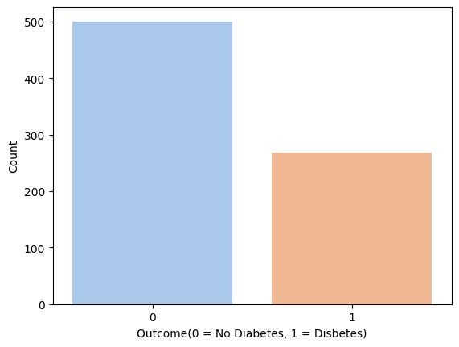
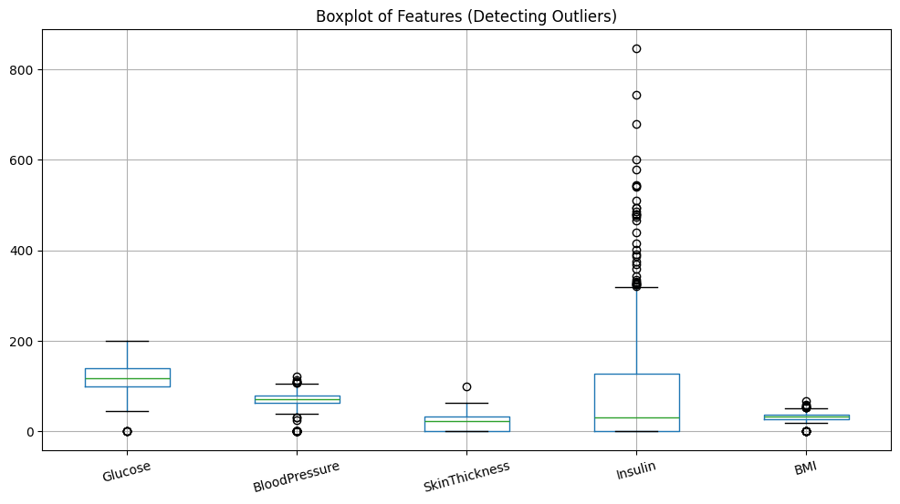
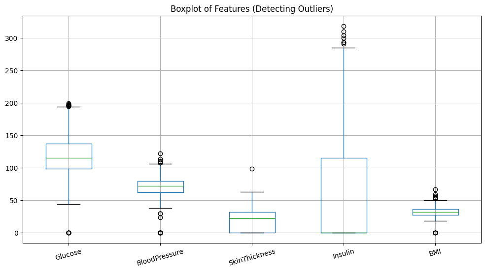
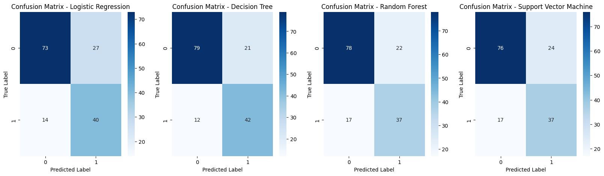
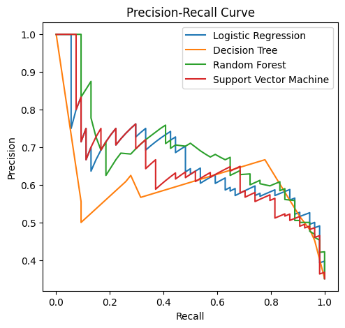
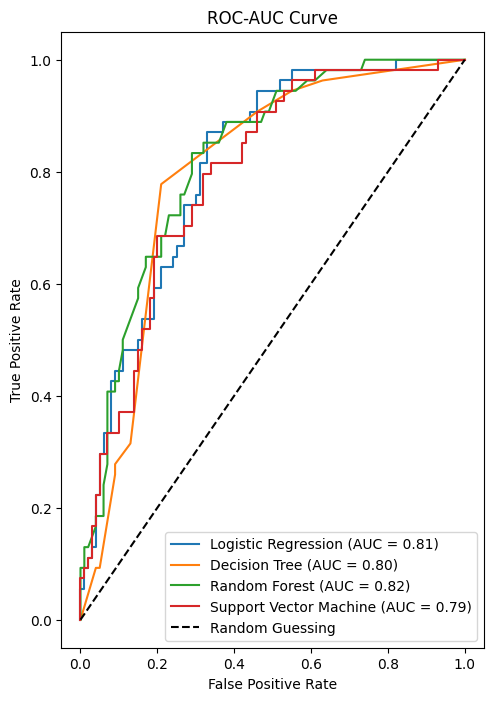
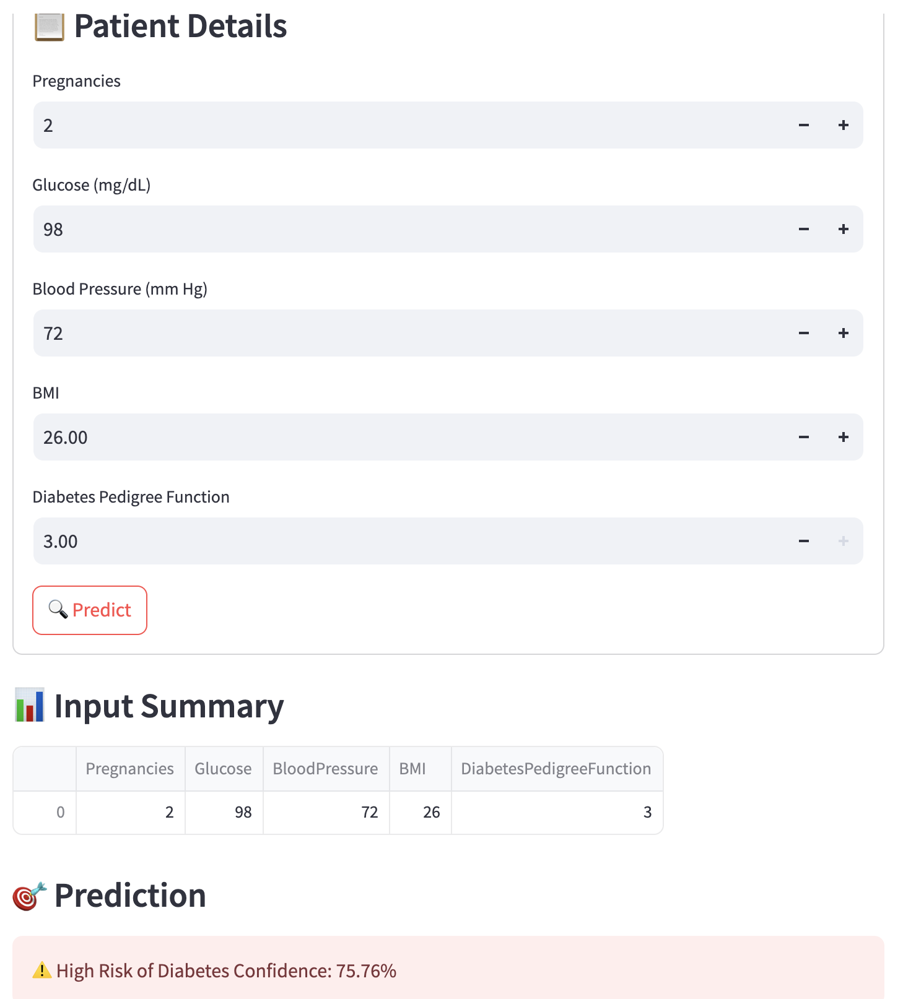

# 🧠 Diabetes Prediction using Machine Learning

A machine learning classification project that predicts diabetes using medical attributes such as glucose levels, BMI, and more. The pipeline includes data preprocessing, exploratory data analysis (EDA), feature selection with RFE, class balancing with SMOTE, model training & evaluation, and deployment using Streamlit.

---

## 📁 Dataset

- **Source**: [PIMA Indian Diabetes Dataset (Kaggle)](https://www.kaggle.com/datasets/uciml/pima-indians-diabetes-database)
- **Target Variable**: `Outcome` (0 = No Diabetes, 1 = Diabetes)
- **Features**:  
  `Pregnancies`, `Glucose`, `BloodPressure`, `SkinThickness`, `Insulin`, `BMI`, `DiabetesPedigreeFunction`, `Age`

---

## 📊 1️⃣ Exploratory Data Analysis (EDA)

### 🔹 Outcome Distribution  
This shows an imbalanced dataset, with more non-diabetic patients than diabetic ones.
> ⚠️ Addressed using SMOTE during preprocessing.
  

---

### 🔹 Correlation Heatmap  
Highlights relationships between features and the target.  
- **Glucose** has the highest correlation with diabetes.
- BMI, Age, Pregnancies are also moderately predictive.

---

### 🔹 Pairplot – Feature Relationships by Class  
Multivariate scatterplots color-coded by `Outcome`.  
- Glucose, Age, BMI show good class separation.
- Helps spot feature effectiveness visually.

---

### 🔹 Outlier Detection – Boxplots

**Before IQR Filtering (Raw Data):**  
- **Insulin** has extreme outliers (>800), which can distort scaling and model learning.

**After IQR Filtering (Cleaned Data):**  
- Outliers reduced for Insulin using IQR method.
- Outlier removal was done **only once** to avoid overfitting or shrinking data unnecessarily.

---

## 🧪 2️⃣ Feature Selection using RFE

### 🔹 Why RFE?
- **Recursive Feature Elimination (RFE)** helps remove less useful features by recursively training a base model.
- Improves generalization and reduces overfitting.

### ✅ Top 5 Features Selected:
- `Pregnancies`
- `Glucose`
- `BloodPressure`
- `BMI`
- `DiabetesPedigreeFunction`

---

## 🧠 3️⃣ Model Training & Evaluation

Trained four models with hyperparameter tuning:
- Logistic Regression
- Decision Tree
- Random Forest
- Support Vector Machine (SVM)

---

### 🔹 Confusion Matrices  
Breakdown of model predictions:

| Model | False Negatives (missed diabetics) | False Positives (false alarms) |
|-------|------------------------------------|--------------------------------|
| **Decision Tree** ✅ | **12** (Best Recall) | 21 |
| Random Forest | 17 | 22 |
| Logistic Regression | 14 | **27** (Most FP) |
| SVM | 17 | 24 |

---

### 🔹 Precision-Recall Curve  
Great for imbalanced datasets.

- **Random Forest** maintains high precision across recall.
- **Decision Tree** fluctuates but reaches high recall.
- **SVM** is best when minimizing false positives.

📌 Use:
- **DT/RF** for high recall (detect more diabetes).
- **SVM** for high precision (avoid false alarms).

---

### 🔹 ROC-AUC Curve  
Shows model's ability to distinguish between diabetic and non-diabetic.

| Model | AUC Score |
|-------|-----------|
| 🥇 Random Forest | **0.82** |
| Logistic Regression | 0.81 |
| Decision Tree | 0.80 |
| SVM | 0.79 |

---

### 🔹 Model Metrics Overview

| Model                | Accuracy | Precision | Recall | F1-Score |
|---------------------|----------|-----------|--------|----------|
| **Decision Tree** ✅ | **0.7857** | **0.6667**    | **0.7778** | **0.7179** |
| Random Forest        | 0.7468   | 0.6271    | 0.6852 | 0.6549 |
| Logistic Regression  | 0.7338   | 0.5970    | 0.7407 | 0.6612 |
| SVM                  | 0.7338   | 0.6066    | 0.6852 | 0.6435 |

---

## 🏁 4️⃣ Final Model Verdict

| Goal                                | Best Model           |
|-------------------------------------|----------------------|
| Catch all diabetic cases (recall)   | ✅ Decision Tree      |
| Best discrimination (AUC)           | Random Forest        |
| Avoid false positives (precision)   | SVM                  |

🎯 **Deployment Choice:** Decision Tree – best balance of recall and performance.

---

## 🧪 5️⃣ Streamlit App

A lightweight web app (`app.py`) lets you enter patient data and predict diabetes risk using the trained model.

### ▶️ Run the app

Make sure the following files are in the same folder:
- `app.py`
- `diabetes_dt_model.pkl`
- `scaler.pkl`
- `selected_features.pkl`

Open the terminal, navigate to the project folder, and run:
`streamlit run app.py`

The app will show:
- Prediction: **High/Low Risk**
- Confidence score (%)

---

## 📝 License

This project is licensed under the [MIT License](License).
