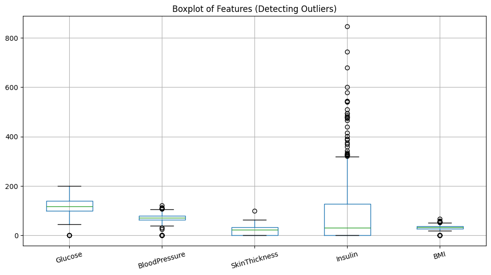
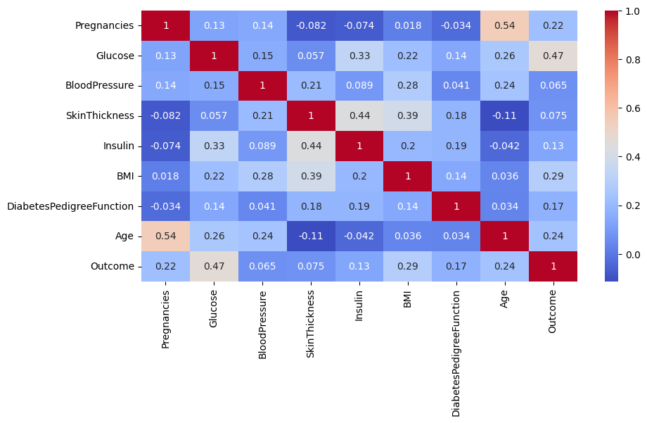
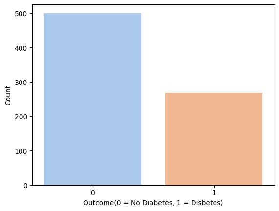
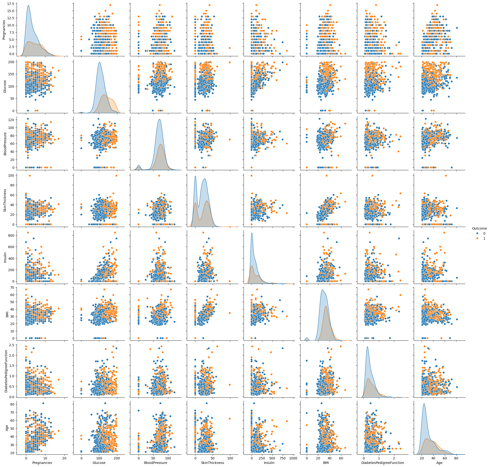
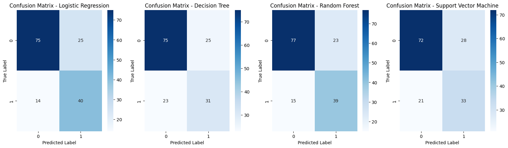
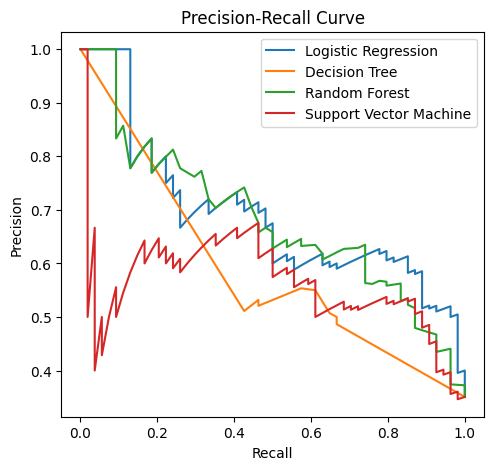
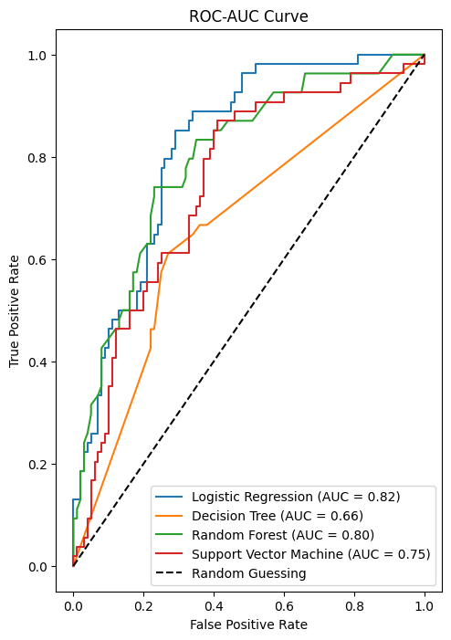

# 🩺 Diabetes Prediction using Machine Learning
A **classification model** to predict diabetes based on patient medical attributes using **Logistic Regression, Random Forest, Decision Trees, and Support Vector Machine **.  
The project includes **data preprocessing, feature selection (RFE), class balancing (SMOTE), and model evaluation** using Precision-Recall, ROC-AUC curves, and Confusion Matrices.

🚀 **Best Model:** Decision Tree (Highest Accuracy & Recall)  
📊 **Tech Stack:** Python, Scikit-Learn, Pandas, NumPy, Matplotlib, Seaborn

---

## 📌 Features:
✅ **Data Preprocessing** (Handling missing values, outliers, and scaling)  
✅ **Feature Selection** using Recursive Feature Elimination (RFE)  
✅ **Class Balancing** with SMOTE  
✅ **Multiple Model Training & Evaluation**  
✅ **Model Performance Analysis** (Confusion Matrix, Precision-Recall, ROC-AUC)  
✅ **Interactive Streamlit App for Predictions**  

---

## 📊 Dataset:
📌 **Pima Indians Diabetes Database**  
📂 **Source:** [Kaggle Dataset](https://www.kaggle.com/datasets/uciml/pima-indians-diabetes-database)  
- **Contains:** 768 patient records with 8 medical attributes  
- **Target Variable:** `Outcome` (1 = Diabetic, 0 = Non-Diabetic)

| Feature               | Description |
|-----------------------|-------------|
| Pregnancies          | Number of times pregnant |
| Glucose              | Plasma glucose concentration |
| BloodPressure        | Diastolic blood pressure (mm Hg) |
| SkinThickness        | Triceps skin fold thickness (mm) |
| Insulin              | 2-Hour serum insulin (mu U/ml) |
| BMI                  | Body mass index (weight/height²) |
| DiabetesPedigreeFunction | Diabetes hereditary score |
| Age                  | Age in years |
| Outcome (Target)     | 1 = Diabetes, 0 = No Diabetes |

---

## **1️⃣ Data Preprocessing**
🔹 Checking for missing values.  
🔹 Removed **outliers in Insulin** using the **IQR method**.  

🔹 **Standardized features** using **Z-score Normalization (StandardScaler)**.

---

## **2️⃣ Exploratory Data Analysis (EDA)**  
🔹 **Heatmap of feature correlations** to check feature importance.

🔹 **Pairplot Analysis** to understand Feature Relationships

🔹 **Class Distribution** to to identify data imbalance

---
1️⃣ 2️⃣ 3️⃣ 4️⃣ 5️⃣ 6️⃣ 7️⃣ 8️⃣
## **3️⃣ Feature Selection using RFE**
### ✅ What is RFE?  
- **Recursive Feature Elimination (RFE)** is a feature selection technique that **iteratively removes less important features** to improve model performance.
- It helps in **identifying the most relevant features** while reducing dimensionality and noise.

---

### ✅ Why Use RFE?  
✔ **Improves Model Generalization** – Reduces overfitting by selecting only the most important features.  
✔ **Enhances Model Efficiency** – Reducing features improves training speed and simplifies the model.  
✔ **Boosts Interpretability** – Helps understand which features contribute most to predictions.  

---

### ✅ Features Selected by RFE:
- **Pregnancies**
- **Glucose**
- **BloodPressure**
- **BMI**
- **DiabetesPedigreeFunction**
  
---

## **4️⃣ Model Training & Parameter Tuning**
🔹 **Trained multiple models:**  
- Logistic Regression  
- Decision Tree  
- Random Forest  
- Support Vector Machine
  
---

🔹 **Hyperparameter tuning using GridSearchCV**  
- **Logistic Regression:** Tuned `C`, `max_iter`.  
- **Decision Tree & Random Forest:** Tuned `max_depth`, `min_samples_split`.
- **Support Vector Machine (SVM):** Tuned `C`, `kernel`, `gamma`.

---

---
## **📊 Results & Performance Metrics**
🔹 **Confusion Matrix** to analyze True Positives & False Negatives.

🔹 **Precision-Recall & ROC-AUC curves** for model evaluation.  

📌 **Best Model:** **Logistic Regression (AUC = 0.82), Random Forest (AUC = 0.80)** 

---

## **📌 Conclusion**
✅ **Best Model:** Logistic Regression (AUC = 0.82).  
✅ **Feature selection (RFE) improved accuracy**.  
✅ **Using SMOTE helped in balancing dataset**.  

📌 **Future Work:**  
- Experiment with **XGBoost, Deep Learning** to improve model accuracy

---

## 📜 License
This project is **open-source** under the **MIT License**.

---
